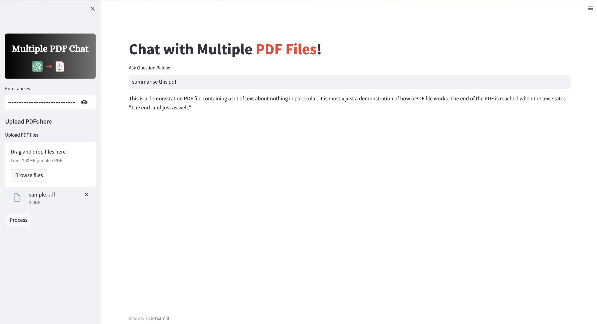

# ChatGPT on multiple PDF files

### This app allows you to upload multiple PDF files and QnA from within them using openai API key

There are two python files:

1- frontend.py (where I built the front end in streamlit)

2- backend.py (where the main functional code is defined)

If you have any questions, feel free to reach out at: https://twitter.com/ZuburuDubuda